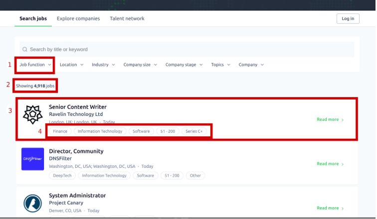
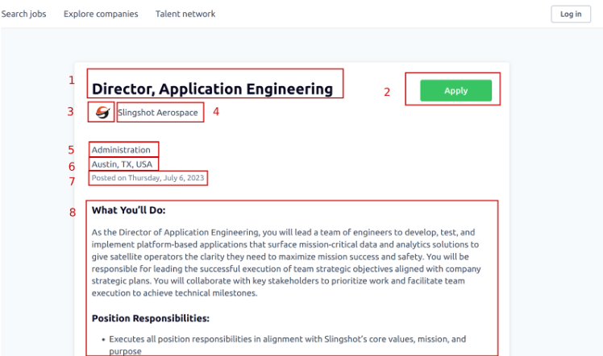

## Application for scraping jobs from jobs.techstars.com by specific job function

### Stack:
spring boot, jsoup, lombok, opencsv, selenium

Spent around ~6-7 hours

### List page:
- Url to page - https://jobs.techstars.com/jobs
- Use the “Job function” dropdown menu to choose a specific job function.
- Collect all jobs filtered by specific job function

1. job function dropdown menu 
2. number of filtered jobs results
3. job item
4. tags
-------------------------------------------------
### Item:
- For every job, you need to gather next points:

1. position name
2. url to organization
3. logo
4. organization title
5. labor function
6. address
7. posted date
8. description
-------------------------------------------------
### Data to collect (Data points):
- (If some data is not provided, the field should be 'NOT_FOUND')
1. job page url on jobs.techstars.com
2. position name
3. url to organization
4. logo (save only link to image)
5. organization title
6. labor function
7. location (can be one line string)
8. posted date (can be one line string, preferer - parse and save in Unix Timestamp)
9. description (can be as text content, preferee - save with html formatting)
10. tags names (can be one line string separated by coma)
-------------------------------------------------
### Technical requirements:
1. For sending requests to the website, you can use any of the following:
    - okhttp
    - jsoup
2. As framework, you can use - Spring Boot
3. If you decide to render page to get information from site pages, use any of the following:
    - Selenium
    - Playwright
4. Database for storing data - any of sql (PostgreSQL, MySQL)
5. Datasource interaction through ORM
6. Build tools preference use the Maven
-------------------------------------------------
### Must have:
1. All your source code should be uploaded to VCS. 
(GitHub, GitLab, Bitbucket)
2. Enforcement of Object-Oriented Programming (OOP) principles 
and adherence to clean code practices
3. Scraping results - only first page of one of any job function
4. Scraping results can be dumped to SQL file, with database creation
schema or in CSV format
5. INSTALL.md - instructions on how to configure and run the project
6. README.md - with short description
-------------------------------------------------
### Result of task:
1. Fully working code with additional files (INSTALL.md, README.md) uploaded on any VCS
2. Scraping results in SQL database dump uploaded on google drive or CSV file
